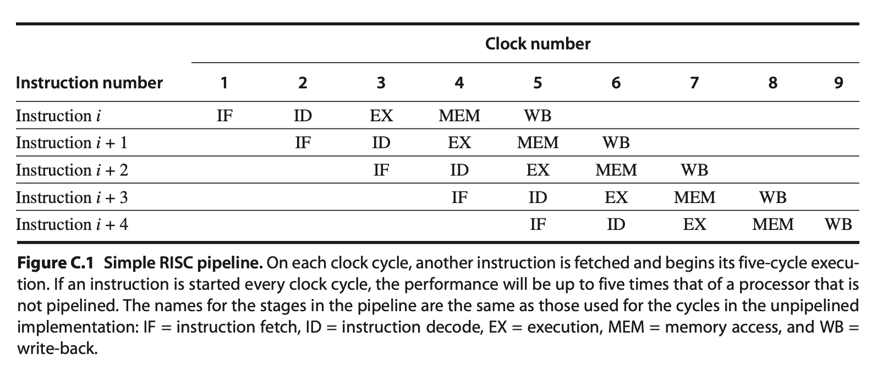

# CPU

## CPU架构演进（SMP、NUMA）

CPU的频率达到瓶颈后转向多核的发展方向，而 CPU 多核之间主要存在两种架构体系分别是 SMP 和 NUMA 架构，通过 `lscpu` 即可查看CPU 的 numa 信息。

* **SMP(Symmetric Multi-Processor)**

对称多处理器结构的主要特征是共享，即所有CPU共享所有的资源（总线，内存，I/O）等。操作系统管理着一个队列，每个处理器依次处理队列中的进程。如果两个处理器同时请求访问一个资源（例如同一段内存地址），由硬件、软件的锁机制去解决资源争用问题。这同时也预示着SMP最大的问题就是扩展性，CPU 利用率很快便达到了瓶颈。

* **NUMA(Non-Uniform Memory Access)**

NUMA 解决了 SMP 扩展性的问题。NUMA 的主要特征是将 CPU 进行分组，每组 CPU 共享内部的内存，I/O 资源。不同组别之间的 CPU通过 CPU 内互联网络连接。从而解决了 CPU 共享的问题。不过这也造成了 CPU 访问远端内存的速度要远小于访问本地的内存。

## <span id="pipeline">CPU pipeline</span>

**标量处理器**CPU内部一般采用标量流水线技术，即一个 CPU 指令一般分为五个阶段：取址(IF)，译码(ID)，执行(EX)，访存(MEM)，写回(WB)。所以一般一个 CPU 指令需要 4～5 个时钟周期(取决于是否需要访存)。如果指令间没有依赖关系，则多个指令可以并行执行，而当指令间存在依赖时，则后一个指令必须等待前一个指令执行完才可以执行。



**超标量处理器**是在单个处理器内一种称为指令级并行的并行形式的CPU。与每个时钟周期最多可以执行一条指令的标量处理器相比，超标量处理器可以通过同时将多条指令分派到处理器上的不同执行单元来在一个时钟周期内执行多条指令。

### Parallel

CPU 硬件支持的并行主要包括线程并行，指令级并行，数据并行。

线程并行

线程并行是指在同一时间内，不同的线程同时执行。线程之间没有依赖关系。现代CPU一般具有多个核心，开启超线程后，每个核心可以开启两个线程，每个线程可以独立的处理不同的任务。从而同一时间点，由多个CPU核心同时工作。

指令级并行

指令级并行依赖于**指令级流水技术，**通过指令级的流水达到在同一时间点(指令周期，更准确的说)内，无数据依赖的指令同时执行。

数据并行

数据并行主要指 `SIMD`(Single -Instruction ,Multple -Data) 单指令多数据流技术。通过一个指令，对多个相同类型的数据(也叫"数据向量”)进行同样的操作。

### Out-of-Order Execution

为了最大化流水线的执行效率，CPU通过乱序执行来优化并发执行的效率。乱序执行分为两种情况：

1. 在编译期，编译器进行指令重排。
2. 在运行期，CPU 进行指令乱序执行。

### branch prediction

Intel的CPU的乱序执行通常会让一些指令提前执行，而分支预测则有可能打破这种秩序。如果分支预测成功，则乱序执行会提升程序的执行效率，而当分支预测失败，则提前计算的CPU指令变为无效。如果保持较高的分支预测效率，分支预测便可以提升流水线的性能。

分支预测成功率主要是为了解决CPU流水线阻塞的问题。一般分为静态分支预测和动态分支预测的方法。

静态分支预测是软件侧的分支预测实现，更准确的说是通过编译器来达到更好的分支预测结果，减少pipeline flush。

动态分支预测主要分为两种，首先是分支结果的预测，对分支结果预测主要是为了减少pipeline stall。其次是分支跳转指令地址预测，即BTA(Branch Target Address)的预测。

程序中通常通过__builtin_expect函数提示编译器来增加分支预测的准确性。

```c++
#if !defined(likely)
#    define likely(x)   (__builtin_expect(!!(x), 1))
#endif
#if !defined(unlikely)
#    define unlikely(x) (__builtin_expect(!!(x), 0))
#endif
```

#### branchless

CPU的乱序执行可以提高指令的并行度，但遇到分支判断失败时，则提前执行的指令需要重新执行。大大降低了程序的执行效率，对于分支跳转不确定的场景下，分支判断失败不能享受乱序执行的优势。这时我们可以通过无分支的代码来避免分支预测失败带来的副作用。branchless 通常情况下可以提升系统的性能，尤其是在选择率较低的场景下。下面的程序用于计算数组中大于0的元素个数。通常的带有分支判断的写法如下：

```c++
int count_positive(const int *src, 
                     size_t count) 
{
    int res = 0;
    for(size_t i = 0; i < count; ++i) {
        if(src[i] >= 0) {
            res++;
        }
    }
    return res;
}
```

在带有分支判断的实现中，分支判断成功时，res加1，分支判断失败时，res不变。实际上我们可以直接用`res += (src[i] >= 0)`来代替分支判断的结果，这样便可以去掉分支判断对性能的影响。不带有分支判断实现的好处在于无论分支判断的选择率如何，性能会比较稳定，不会出现较大的波动。具体实现如下面的代码所示：

```c++
int count_positive(const int *src, 
                     size_t count) 
{
    int res = 0;
    for(size_t i = 0; i < count; ++i) {
    	  res += (src[i] >= 0);
    }
    return res;
}
```

实际上，对于这类简单的分支判断，我们也可以使用SIMD Intrinsic来完成向量化实现。SIMD可以使程序在没有自动向量化的情况下也可以实现更高的性能。SIMD的写法如下：

```c++
int count_positive(const int * src, size_t count)
{
    int res = 0;
    for (size_t i = 0; i < count; i += 8) {
        const __m256i *vsrc = reinterpret_cast<const __m256i *>(src + i);
        __m256i mask = _mm256_cmpgt_epi32(*vsrc, _mm256_setzero_si256());
        res += __builtin_popcount(_mm256_movemask_ps((__m256)mask));
    }
    return res;
}
```

branchless 相比branch虽然消耗了更多的CPU Instructions，但实际上在选择率低于50%的场景下，branchless性能更好，所需要的CPU Cycles更少。SIMD版本的性能最好，因为消耗最少的CPU Instructions。

### memory barrier/memory fence/CPU fence

C++11 中的std::atomic描述了 6 种可以应用于原子变量的内存次序:

- momory_order_relaxed,
- memory_order_consume,
- memory_order_acquire,
- memory_order_release,
- memory_order_acq_rel,
- memory_order_seq_cst.

但它们表示的是三种内存模型:(memory_order_consume目前被当成memory_order_acquire处理)

- sequential consistent(memory_order_seq_cst),
- relaxed(memory_order_relaxed)
- acquire release(memory_order_consume, memory_order_acquire, memory_order_release, memory_order_acq_rel),

下面我们分别来介绍一下std::atomic原子变量的内存模型

1. **sequential consistent memory order**

   sequential consistent叫做顺序一致性。是最强的内存序，也是std::atomic默认的内存序。它要求所有线程之间的全局同步。因此在多线程间的同步开销较大，相比于其它线程模型性能会稍差一点。

   * 在`store()`前的所有读写操作，不允许被移动到这个`store()`的后面。
   * 在`store()`后的所有读写操作，不允许被移动到这个`store()`的前面。
   * 在`load()`前的所有读写操作，不允许移动到这个`load()`的后面。
   * 在`load()`后的所有读写操作，不允许移动到这个`load()`的前面。

   在下面的程序中z可能等于1，或者2，但z一定不等于0，所以z != 0的断言不会失败。

   ```c++
   #include <thread>
   #include <atomic>
   #include <cassert>
    
   std::atomic<bool> x = {false};
   std::atomic<bool> y = {false};
   std::atomic<int> z = {0};
    
   void write_x()
   {
       x.store(true, std::memory_order_seq_cst);
   }
    
   void write_y()
   {
       y.store(true, std::memory_order_seq_cst);
   }
    
   void read_x_then_y()
   {
       while (!x.load(std::memory_order_seq_cst))
           ;
       if (y.load(std::memory_order_seq_cst)) {
           ++z;
       }
   }
    
   void read_y_then_x()
   {
       while (!y.load(std::memory_order_seq_cst))
           ;
       if (x.load(std::memory_order_seq_cst)) {
           ++z;
       }
   }
    
   int main()
   {
       std::thread a(write_x);
       std::thread b(write_y);
       std::thread c(read_x_then_y);
       std::thread d(read_y_then_x);
       a.join(); b.join(); c.join(); d.join();
       assert(z.load() != 0);  // will never happen
   }
   ```

2. **relaxed memory order**

   relaxed内存序要求`load()`和`store()`都要是`memory_order_relaxed`,relaxed语义只能保证同一个原子变量的修改是顺序的，也就是说当前线程修改后再读一定读取的是最新修改的值，但其它线程不一定读取的是最新的值。relaxed内存序不能提供跨线程的同步。

   比如下面的程序中，是允许D->A->B->C的执行顺序的，relaxed并不具备跨线程同步的语意，只能保证A->B的顺序。所以下面的程序有可能输出为x=y=42的结果

   ```c++
   //initially
   x = 0; y = 0;
   
   // Thread 1:
   r1 = y.load(std::memory_order_relaxed); // A
   x.store(r1, std::memory_order_relaxed); // B
   // Thread 2:
   r2 = x.load(std::memory_order_relaxed); // C 
   y.store(42, std::memory_order_relaxed); // D
   ```

   但relaxed内存序对于有循环依赖的情况下并不允许

   ```c++
   // Thread 1:
   r1 = y.load(std::memory_order_relaxed);
   if (r1 == 42) x.store(r1, std::memory_order_relaxed);
   // Thread 2:
   r2 = x.load(std::memory_order_relaxed);
   if (r2 == 42) y.store(42, std::memory_order_relaxed);
   ```

   relaxed内存序最典型的使用场景就是递增计数器，比如 `fetch_add(1, std::memory_order_relaxed);`

3. **Acquire release memory order**

   acquire release模型下`store()`使用的是`memory_order_release`,而`load()`使用的是`memory_order_acquire`.acquire release虽然不同线程可以看到不同的排序，但排序的顺序是受限制的，限制条件如下:

   - 在`store()`之前的所有读写操作，不允许被移动到这个`store()`的后面。
   - 在`load()`之后的所有读写操作，不允许被移动到这个`load()`的前面。

   在下面的程序中，thread2中`ptr.store(p, std::memory_order_release)`之前的所有store()操作都一定会完成，而thread1中的`while (!(p2 = ptr.load(std::memory_order_acquire)))`之后的load()也不会提前执行，所以`*p2 == "Hello"`和`data == 42`的断言一定不会失败。

   ```
   //thread1
   std::string* p2;
   while (!(p2 = ptr.load(std::memory_order_acquire)))
   ;
   assert(*p2 == "Hello"); // never fires
   assert(data == 42); // never fires
   
   //thread2
   std::string* p  = new std::string("Hello");
   data = 42;
   ptr.store(p, std::memory_order_release);
   ```

### CPU缓存一致性协议

现代CPU中一般采用的memory hierarchy的方式，越靠近CPU的cache读写速度也越快。多核CPU之间Cache一般是不共享的，所以需要通过缓存一致性协议MESI来保持CPU之间的状态一致。

MESI包括独占(exclusive)、共享(share)、修改(modified)、失效(invalid)，用来描述该缓存行是否被多处理器共享、是否修改。

- 独占(exclusive)：仅当前处理器拥有该缓存行，并且没有修改过，是最新的值。
- 共享(share)：有多个处理器拥有该缓存行，每个处理器都没有修改过缓存，是最新的值。
- 修改(modified)：仅当前处理器拥有该缓存行，并且缓存行被修改过了，一定时间内会写回主存，会写成功状态会变为S。
- 失效(invalid)：缓存行被其他处理器修改过，该值不是最新的值，需要读取主存上最新的值。


