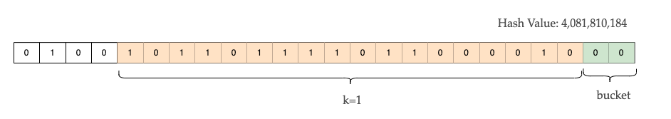

# 数据结构

## hash

哈希算法广泛应用于很多场景，例如安全加密和数据结构中哈希表的查找，布隆过滤器和负载均衡（一致性哈希）等等。

常见的加密哈希算法比如MD5,SHA1,SHA-256, CHACHA20等

常见的查找哈希算法：crc32c,Murmur hash,xxhash, cityhash等

**murmurhash**

murmurhash 是 Austin Appleby 于 2008 年创立的一种非加密哈希算法，适用于基于哈希进行查找的场景。MurMur 经常用在分布式环境中，比如 Hadoop，其特点是高效快速，但是缺点是分布不是很均匀。

**CityHash**

CityHash是由google在2011年 发布的, 其性能好于 MurmurHash。但后来 CityHash 的哈希算法被发现容易受到针对算法漏洞的攻击，该漏洞允许多个哈希冲突发生。

**xxhash**

xxhash 由 Yann Collet 发表，http://cyan4973.github.io/xxHash/ 这是它的官网，据说性能很好，似乎被很多开源项目使用，Bloom Filter 的首选。

### consistent hashing

在分布式系统中，我们可以通过hash分布的方式将数据均匀分布在所有的分布式节点上。但当分布式系统的拓扑发生改变时，也就是增删节点时，往往需要进行数据的重新分布。一致性哈希就是为了解决这一问题而诞生的。

一致性哈希是指将「存储节点」和「数据」都映射到一个首尾相连的哈希环上，如果增加或者移除一个节点，仅影响该节点在哈希环上顺时针相邻的后继节点，其它数据也不会受到影响。 但是一致性哈希算法不能够均匀的分布节点，会出现大量请求都集中在一个节点的情况，在这种情况下进行容灾与扩容时，容易出现雪崩的连锁反应。

Karger在1997年时第一次提出了一致性hash的算法。在2014年Google在论文A Fast, Minimal Memory, Consistent Hash Algorithm提出了最新的一致性hash算法，相比于原来的算法有了很大的提升。下面就是在论文中提出的JumpConsistentHash的算法实现。

```
int32_t JumpConsistentHash(uint64_t key, int32_t num_buckets) {
    int64_t b = -1, j = 0;
    while (j < num_buckets) {
        b = j;
        key = key * 2862933555777941757ULL + 1;
        j = (b + 1) * (double(1LL << 31) / double((key >> 33) + 1));
    }
    return b;
}
```


### linear hashing

Hashtable是最常使用的数据结构之一。Linear Hashing是一种哈希表算法。它通常用于在数据库和文件系统中实现哈希索引。它用于动态调整hashtable。

## HLL

HyperLogLog简称HLL，是一种不精确的去重计数算法，用于解决计算机科学中的count distinct问题和应用数学中的基数估算问题。通常提到去重计算的数据结构，我们可以想到set，bitmap，hashmap等。但在数据量较小的场景下，以上算法尚且可用，但当数据量达到上亿级别时，以上数据结构的内存消耗则迅速变大，性能也不尽如人意。以占用内存较小的bitmap为例，每个元素在bitmap占据一个bit位，对于一百亿条数据的集合，需要10^11/8/1024/1024=1.2GB内存。此时，HyperLogLog就派上了用场了。

首先我们思考一下如果我们要统计一个网站中的用户访问数应该怎么做？

首先我们可以将每个用户的ID通过hash计算后得到一个Int64的整型值，接下来我们做一系列实验来统计从低位到高位来计算第一个1出现的位置。

假设一共有n个用户，那么实验要估算的数据就是n，第一个1出现的位置前导零的个数用k_max表示。比如下面的hash value的k_max为3.


当我们的实验次数足够多时我们可以从下面的公式来估算n的个数
$$
n \approx 2^{k\_max}
$$
但上面的估算在仍然比较粗糙，特别是当统计数量比较少的时候。所以需要一个修正系数来修正结果的正确性。最终的计算公式为
$$
n \approx \frac{2^{k\_max}}{\phi} ；{\phi} ≈ 0.77351
$$
这就是 [Flajolet-Martin](https://en.wikipedia.org/wiki/Flajolet–Martin_algorithm)算法。但上面的算法仍然有不少问题，比如如果样本中有一个hashvalue的k_max非常大，则结果将非常不准确，为了解决某一样本对整体估算结果的影响，LogLog算法就出现了。

LogLog算法做了一个优化就是分桶。假设对于上述所有用户的ID经散列函数计算后得到的hash值，取低4位作为分桶的标记位，分桶的个数为m，然后统计接下来的16位中第一个1出现的位置前导零的个数位k。



最后将所有桶的k最大值取平均值。那么公式就变为了
$$
n \approx const \times m\times 2^{\displaystyle \frac{k1+k2+...+km}{m}}
$$
LogLog算法采用的是几何平均值来计算k,但缺点是仍然受某些极值的影响比较大，比如`k_max1=100, k_max2=1`,平均下来就是`50.5`，这样的统计信息仍然不准确。

HyperLogLog算法在LogLog算法的基础上，将几何平均值改为了调和平均值。调和平均值将极值对整个统计结果的影响降到了最低，从而将估算的准确率提高到了最高的水平。
$$
n \approx const \times m\times {\displaystyle \frac{m}{2^ {1/k1+1/k2+...+1/km}}}
$$
以上就是HyperLogLog算法的原理介绍。从[HyperLogLog: the analysis of a near-optimal cardinality estimation algorithm](http://algo.inria.fr/flajolet/Publications/FlFuGaMe07.pdf)论文可以看到详细的推导证明。


## RoaringBitmap

RoaringBitmap表示压缩位图索引。在这之前我们先得了解什么是Bitmap。Bitmap索引经常被用在数据库和搜索引擎中。通过利用位并行运算的优势，它能够显著地加速查询。但是，它也有一个缺点，那就是会耗费更多的内存，因此就有了压缩的BitMap索引。在Bitmap压缩方案中，Roaring bitmaps基于RLE的压缩性能更好。

## BloomFilter

*Bloom Filter*是由Bloom在1970年提出的一种空间效率高的概率型数据结构。它可以用来查找某一个元素是否存在于集合中。

BloomFilter有几个关键的参数。

`m`代表由m个bit组成的位数组，初始化全部为0。

`k`代表有k个哈希函数，每个哈希函数的作用是将集合中的某个元素哈希映射到位数组的某一个位置，并将对应的bit位置为1。

BloomFilter有两个主要的方法：插入和查找。

插入：将要插入的一个元素经过哈希函数映射到位数组的某一个bit位，将对应的bit位置为1。所以k个哈希函数可以将位数组的k个bit位置为1。

查找：将要查找的元素经过k次哈希函数计算后找到位数组的k个bit位，如果对应的bit位都为1，则表示该元素可能存在于集合中。而如果有一个bit位不为1，则表示该元素一定不在集合中。

从以上的介绍中可以发现，BloomFilter可能存在误判，也就是说某一个元素可能不存在集合中，但其对应的bit位都为1.

衡量BloomFilter的误判率称为false positives。 false positives可以通过以下公式计算得到
$$
\epsilon = (1-(1-1/m)^{kn})^{k} \approx(1-e^{-kn/m})^{k}
$$
n表示插入的元素的个数。

由此我们可以得出最优的散列函数的个数k可以通过下面的计算得到
$$
k = m/n ln2
$$
位数组中位的大小m可以计算通过下面的计算得到
$$
m = -nlnP/(ln2)^2
$$
一般我们可以根据误判率来计算得到位数组的大小m，同时得到散列函数的个数k。

由上面的分析我们可以写出一个bloomfilter的实现

```
class BloomFilter
  {
    public:
        BloomFilter(size_t size_, size_t hashes_);

        bool find(const char * data, size_t len);
        void add(const char * data, size_t len);

    private:
        size_t size;
        size_t hashes;
        std::vector<char> filter;
  };

  BloomFilter::BloomFilter(size_t size_, size_t hashes_)
    : size(size_), hashes(hashes_), filter(size, 0)
  {
  }

  bool BloomFilter::find(const char * data, size_t len)
  {
      for (size_t i = 0; i < hashes; ++i)
      {
          size_t pos = std::hash<std::string_view>()(std::string_view{data, len}) % (8 * size);
          if (!(filter[pos / 8] & (1ULL << (pos % 8 ))))
                  return false;
      }
      return true;
  }

  void BloomFilter::add(const char * data, size_t len)
  {
      for (size_t i = 0; i < hashes; ++i)
      {
          size_t pos = std::hash<std::string_view>()(std::string_view{data, len}) % (8 * size);
          filter[pos / 8] |= (1ULL << (pos % 8));
      }
  }
```


BloomFilter有多种变种，比如ribbon filters， cuckoo filter， SIMD blocked Bloom filter，Xor Filter等。相比于经典的BloomFilter算法，新的变种在性能上，空间使用上已经有了很大的提升。


## SkipList

跳表，Btree+的简单实现。是一个有序的链表。跳表的查询的时间复杂度为 O(logn）插入和删除的时间复杂度也为 O(logn)。


## ConcurrentHashMap

线程安全的HashMap实现。


Reference:

1. HyperLogLog 

   https://towardsdatascience.com/hyperloglog-a-simple-but-powerful-algorithm-for-data-scientists-aed50fe47869

   https://engineering.fb.com/2018/12/13/data-infrastructure/hyperloglog/

   http://content.research.neustar.biz/blog/hll.html

2. BloomFilter

   http://oserror.com/backend/bloomfilter/

3. Hash

   http://cyan4973.github.io/xxHash/

   http://www.alloyteam.com/2017/05/hash-functions-introduction/

4. Linear Hash

   https://ruby-china.org/topics/39466

   https://hackthology.com/linear-hashing.html

   https://dsf.berkeley.edu/jmh/cs186/f02/lecs/lec18_2up.pdf
