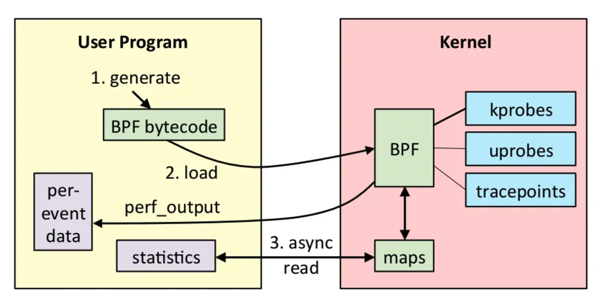

## 定位系统瓶颈

新的系统或者功能在上线前一般会遇到各种各样的瓶颈，或是 BUG,内存泄漏抑或是性能瓶颈，这就需要我们能够了解整个系统的运行状况并快速定位系统的瓶颈。俗话说：工欲善其事，必先利其器。linux 提供了丰富的性能定位分析工具，比如perf，ptrace，eBPF等，除此之外还有丰富的内存泄漏定位工具可供使用，比如 valgrind, sanitizer, gperftools 等。

## 系统监控

### 查看系统监控

#### top

​		top通常是查看系统负载，CPU利用率，进程内存使用情况最常使用的工具。Load average 中的三个数字分别代表 1 分钟，5 分钟，15 分钟的正在运行或者等待运行的进程个数。top -u user 可以查看某个用户的进程信息。top -p pid 查看某个进程的信息。如果想要查看某个 cpu 的信息，可以使用 `mpstat -P $coreid `来查看。

top 中最常关注的还有 RSS，一般指的是物理内存的占用情况。RSS越大就证明进程的内存占用越多，如果持续增长有可能是内存泄漏的问题。

#### lscpu

Linux 操作系统下，cpu 相关的信息一般存在于 \proc 文件夹下面的 cpuinfo 文件中。通过 cat /proc/cpuinfo 可以查看。更常用的命令是 lscpu 。在 lscpu 中我们可以看到 CPU 的 Architecture 表示架构信息是 x86_64 架构，CPU(s) 共96个核，NUMA nodes 表示2个numa 组，其中 0-47 个核属于 numa0，48-95 核属于 numa1。CPU MHz 表示 CPU 的主频，L1d cache，L1i cache ,表示L1cache的大小，L1cache 分别指令缓存和数据缓存。L1/ L2 cache 为各个 CPU 独自拥有的。L3 cache 是每个 numa 组内共享的，Flags 表示支持的 ISA 指令集等等信息。

```
Architecture:        x86_64
CPU op-mode(s):      32-bit, 64-bit
Byte Order:          Little Endian
CPU(s):              96
On-line CPU(s) list: 0-95
Thread(s) per core:  2
Core(s) per socket:  24
Socket(s):           2
NUMA node(s):        2
Vendor ID:           GenuineIntel
CPU family:          6
Model:               85
Model name:          Intel(R) Xeon(R) Platinum 8361HC CPU @ 2.60GHz
Stepping:            11
CPU MHz:             2593.906
BogoMIPS:            5187.81
Hypervisor vendor:   KVM
Virtualization type: full
L1d cache:           32K
L1i cache:           32K
L2 cache:            1024K
L3 cache:            36608K
NUMA node0 CPU(s):   0-47
NUMA node1 CPU(s):   48-95
Flags:               fpu vme de pse tsc msr pae mce cx8 apic sep mtrr pge mca cmov pat pse36 clflush mmx fxsr sse sse2 ss ht syscall nx pdpe1gb rdtscp lm constant_tsc rep_good nopl cpuid tsc_known_freq pni pclmulqdq ssse3 fma cx16 pcid sse4_1 sse4_2 x2apic movbe popcnt tsc_deadline_timer aes xsave avx f16c rdrand hypervisor lahf_lm abm 3dnowprefetch invpcid_single pti fsgsbase bmi1 hle avx2 smep bmi2 erms invpcid rtm mpx avx512f avx512dq rdseed adx smap clflushopt clwb avx512cd avx512bw avx512vl xsaveopt xsavec xgetbv1 avx512_bf16 arat avx512_vnni
```

#### free

内存及 IO 相关的系统一般存在于 \proc 文件夹下面的 meminfo 文件中，通过 cat /proc/meminfo 可以查看。

 free 是更常用的查看内存大小的命令。`free -h` 表示按照GB显示大小 。命令输出中可以看到 total 代表总的内存大小，used 代表已使用的内存大小，buffer/cache 的内存大小，available 的内存大小。可以发现 total 的大小等于 free 的内存加上 buff/cache 的内存大小再加上 used 的大小。

这里的buff/cache包括的是 page cache 和 buffer cache 的大小之和。page cache 用作文件系统的文件缓存，比如进程对文件 read/write 操作或者 mmap 调用时使用。buffer cache 也是block cache是用作系统对块设备读写时的缓存。

在 Linux 内核中可以通过 修改 /proc/sys/vm/drop_caches 来清理 buff/cache。

**echo 1 > /proc/sys/vm/drop_caches**:表示清除pagecache。

**echo 2 > /proc/sys/vm/drop_caches**:表示清除回收slab分配器中的对象（包括目录项缓存和inode缓存）。slab分配器是内核中管理内存的一种机制，其中很多缓存数据实现都是用的pagecache。

**echo 3 > /proc/sys/vm/drop_caches**:表示清除pagecache和slab分配器中的缓存对象。

需要注意的是 tmpfs 的内存占用也是显示在 buff/cache 中的。

swap 表示的是交换内存的信息，如果未开启，则显示的都是0。

```
              total        used        free      shared  buff/cache   available
Mem:          278Gi        13Gi       134Gi       1.0Gi       129Gi       262Gi
Swap:            0B          0B          0B
```

#### vmstat

​	vmstat命令显示virtual memory 统计信息。vmstat的语法是

```
vmstat [options] [delay [count]]
```

例如，vmstat 通常使用 `vmstat -Sm 1`，表示vmstat 每间隔1s打印一次，输出结果对齐显示。

vmstat 命令中包括了 CPU 使用，内存使用，虚拟内存交换 swap，IO 使用情况，每秒上下文切换 cs 等信息。

```
$ vmstat -Sm 1
procs -----------memory---------- ---swap-- -----io---- -system-- ------cpu-----
 r  b   swpd   free   buff  cache   si   so    bi    bo   in   cs us sy id wa st
 0  0      0 108766   2431 138106    0    0     6    70    0    0  2  0 97  0  0
 1  0      0 108777   2431 138106    0    0     0     0 39497 77322  0  0 100  0  0
 1  0      0 108777   2431 138106    0    0     0   128 39869 77642  0  0 99  0  0
 1  0      0 108764   2431 138109    0    0     0  1692 39860 78093  0  0 99  0  0
 0  0      0 108766   2431 138107    0    0     0   472 39661 77805  0  0 100  0  0
 0  0      0 108881   2431 138107    0    0     0   188 39611 77591  0  0 100  0  0
 0  0      0 108881   2431 138107    0    0     0     0 39466 77274  0  0 100  0  0
 0  0      0 108880   2431 138107    0    0     0    68 39627 77494  0  0 100  0  0
```

Procs（进程）:

- r: 运行队列中进程数量
- b: 等待IO的进程数量

Memory（内存）:

- swpd: 使用虚拟内存大小
- free: 可用内存大小
- buff: 用作缓冲的内存大小
- cache: 用作缓存的内存大小, cache 用于提高性能

Swap:

- si: 每秒从交换区写到内存的大小
- so: 每秒写入交换区的内存大小

IO：

- bi: 每秒读取的块数
- bo: 每秒写入的块数

system：

- in: 每秒中断数，包括时钟中断
- cs: 每秒上下文切换数

CPU

- us: 用户进程执行时间(user time)
- sy: 系统进程执行时间(system time)
- id: 空闲时间(包括IO等待时间)
- wa: 等待IO时间

cs 代表进程上下文切换的次数。cs 越大表示进程上下文切换对性能的影响越大，可能是影响系统性能的瓶颈。

对于 context switch，可以通过 `pidstat -p ${pid} -w` 命令在查看指定进程的内存上下文切换情况。pidstat 命令中 cswch 与 nvcswch 是重点关注的对象。cswch 表示每秒自愿上下文切换（voluntary context switches）的次数，nvcswch 表示每秒非自愿上下文切换（non voluntary context switches）的次数。

所谓自愿上下文切换，是指进程无法获取所需资源，导致的上下文切换。比如说， I/O、内存等系统资源不足时，就会发生自愿上下文切换。

而非自愿上下文切换，则是指进程由于时间片已到等原因，被系统强制调度，进而发生的上下文切换。比如说，大量进程都在争抢 CPU 时，就容易发生非自愿上下文切换。

#### iostat

iostat 输出了  IO 统计信息, iostat 的语法是

```
iostat  [ -c ] [ -d ] [ -h ] [ -k | -m ] [ -N ] [ -t ] [ -V ] [ -x ] [ -y ] [ -z ] [ -j { ID | LABEL | PATH | UUID | ... } ] [ [ -T ] -g group_name ] [ -p [ device [,...] | ALL ] ] [ device [...] | ALL ] [ interval [ count ] ]
```

iostat数据来源是Linux操作系统的/proc/diskstats。

 iostat -c 输出CPU信息，包括user, nice, system,iowait. steal, idle信息。

```
iostat -c
Linux 5.4.119-1-tlinux4-0008 (VM-85-83-centos) 	10/11/22 	_x86_64_	(96 CPU)

avg-cpu:  %user   %nice %system %iowait  %steal   %idle
           2.42    0.00    0.39    0.20    0.00   96.99
```

* **user** 进程在用户态执行中消耗 CPU 时间的百分比。

* **nice** 具有最高优先级进程在用户态执行中消耗CPU时间的百分比。

* **system** 进程在内核地址空间中消耗 CPU 时间的百分比。

* **iowait** CPU 等待磁盘 IO 操作的时间。在系统平均负载过高时，可以通过 iowait 来判断系统的性能瓶颈是不是过多的 IO 操作造成的。

* **steal** 宿主机 CPU 目前在服务于其它虚拟机，当前虚拟机等待宿主机 CPU 服务的时间占比

* **idle** CPU 处于 idle 状态的百分比。一般情况下， user + nice + idle 应该接近 100%。

iostat -d {sda,sdb}显示设备信息，iostat -d -p {sda, sdb} 显示设备分区信息，设备信息提供每个物理设备或分区的统计信息。

iostat -x 命令可以查看IO utils，观察 IO 是否达到了系统瓶颈，如果 IO 一直处于较高的利用率，可以考虑使用RAID 磁盘阵列或者更换更快的 SSD 盘来解决 IO 的读写瓶颈问题。

在 iostat 命令中包括以下信息

```
$ iostat -xdm 1
Linux 5.4.119-1-tlinux4-0008 (VM-85-83-centos) 	10/11/22 	_x86_64_	(96 CPU)

Device            r/s     w/s     rMB/s     wMB/s   rrqm/s   wrqm/s  %rrqm  %wrqm r_await w_await aqu-sz rareq-sz wareq-sz  svctm  %util
vda              0.40    6.96      0.01      0.20     0.03     6.32   6.08  47.56   12.03    5.14   0.03    28.40    28.68   1.45   1.07
vdb              6.49   29.16      0.52      6.38     0.61    26.81   8.65  47.90   17.14    6.53   0.24    81.73   224.14   1.40   5.00
scd0             0.00    0.00      0.00      0.00     0.00     0.00   0.00   0.00    0.27    0.00   0.00     3.68     0.00   0.58   0.00
```

- rrqm/s : 每秒合并读操作的次数
- wrqm/s: 每秒合并写操作的次数
- r/s ：每秒读操作的次数
- w/s : 每秒写操作的次数
- rMB/s :每秒读取的MB字节数
- wMB/s: 每秒写入的MB字节数
- avgrq-sz：每个IO的平均扇区数，即所有请求的平均大小，以扇区（512字节）为单位
- avgqu-sz：平均为完成的IO请求数量，即平均意义山的请求队列长度
- await：平均每个IO所需要的时间，包括在队列等待的时间，也包括磁盘控制器处理本次请求的有效时间。
  - r_wait：每个读操作平均所需要的时间，不仅包括硬盘设备读操作的时间，也包括在内核队列中的时间。
  - w_wait: 每个写操平均所需要的时间，不仅包括硬盘设备写操作的时间，也包括在队列中等待的时间。
- svctm： 表面看是每个IO请求的服务时间，不包括等待时间，但是实际上，这个指标已经废弃。实际上，iostat工具没有任何一输出项表示的是硬盘设备平均每次IO的时间。
- %util： 工作时间或者繁忙时间占总时间的百分比


### 定位性能常用工具

系统性能中最常用的两个指标是吞吐量和延时。对于服务器而言，延时代表的是一次访问所需要的耗时。而吞吐代表的是一段时间内的访问的总次数。一般来说，延时越低，吞吐量越大，系统的性能就越好。

#### perf

预备知识：PMU,PMC

PMU,即perf monitor unit，性能监控单元。每个 PMU 模型包含一组寄存器：性能监视配置 (PMC) 和性能监视数据 (PMD)。这两个寄存器都是可读的，但只有 PMC 是可写的。这些寄存器用于储存配置信息和数据。

Perf,也叫perf events，或perf tools,是Linux内核提供的性能分析工具。perf是基于perf_event_open的内核系统调用。支持硬件性能计数(HPC),软件性能计数，kprobe，uprobe, tracepoints等多种事件。以PMC为例，perf执行的原理如下：

1. 通过 perf_event_open() 的系统调用向内核注册一个PMC 的计数器并在内核中通过mmap申请内存用于保存采样结果。
2. PMC 通过专用的寄存器随 CPU cycles 的增长而累加，当 PMC 溢出时，PMU 会产生一个 PMI 硬件中断。
3. 在中断函数中完成一次采样：采样信息包括HPC计数值，触发中断的指令地址，时间戳，PID 等信息。并存入 perf_event_open() 申请的内存中
4. perf 通过 read 读取采样信息，根据PID等信息找到对应进程，并根据进程ELF符号表解析为对应的函数调用信息。


Perf events：Perf_events包括以下几种类型：

* 硬件事件：PMU产生的CPU性能监控计数
* 软件事件：基于Kernel技术的事件，比如CPU migrations, minor faults, major faults,等

- 内核追踪事件：内核级别的插桩点
- 动态追踪: 包括内核态kprobe和用户态的uprobe事件。
- 时间采样: perf可以指定采用频率，通过 `perf record -F*Hz*`命令。


通过 perf list 可以查看当前perf支持的perf events。

```
List of pre-defined events (to be used in -e):

  branch-instructions OR branches                    [Hardware event]
  branch-misses                                      [Hardware event]
  bus-cycles                                         [Hardware event]
  cache-misses                                       [Hardware event]
  cache-references                                   [Hardware event]
  cpu-cycles OR cycles                               [Hardware event]
  instructions                                       [Hardware event]
  ref-cycles                                         [Hardware event]

  alignment-faults                                   [Software event]
  bpf-output                                         [Software event]
  context-switches OR cs                             [Software event]
  cpu-clock                                          [Software event]
  cpu-migrations OR migrations                       [Software event]
  dummy                                              [Software event]
  emulation-faults                                   [Software event]
  major-faults                                       [Software event]
  minor-faults                                       [Software event]
  page-faults OR faults                              [Software event]
  task-clock                                         [Software event]

  duration_time                                      [Tool event]

  msr/tsc/                                           [Kernel PMU event]

  rNNN                                               [Raw hardware event descriptor]
  cpu/t1=v1[,t2=v2,t3 ...]/modifier                  [Raw hardware event descriptor]
   (see 'man perf-list' on how to encode it)

  mem:<addr>[/len][:access]                          [Hardware breakpoint]
  
  ......
  sched:sched_stat_blocked                           [Tracepoint event]
  sched:sched_stat_iowait                            [Tracepoint event]
  sched:sched_stat_runtime                           [Tracepoint event]
  sched:sched_stat_sleep                             [Tracepoint event]
  sched:sched_stat_wait                              [Tracepoint event]
  skb:consume_skb                                    [Tracepoint event]
  skb:kfree_skb                                      [Tracepoint event]
  skb:skb_copy_datagram_iovec                        [Tracepoint event]
  ......
```

以上是 perf version 5.4.119 版本的输出结果，输出到信息包括 

Hardware event, 包括cache-misses, cpu-clocks, branch-misses等。 

Software event，比如常用的 cpu-clock, context-switches, page-faults, 

Hardware breakpoint , 比如 mem 。 

Tracepoint event 比如常见的 sched, skb 等等。

不同版本的 perf event 可能不一样，如果发现某些 events 不存在可以通过升级perf来解决。

在root用户下执行perf 命令，可以看到指定 -e 来指定需要跟踪的perf events，使用方式如下

```
perf top -e <event list>
perf stat –e <event list>
perf record –e <event list>
```


#### FlameGraph

perf 命令提供了丰富的采用工具，但对于性能分析来说不够直观，而火焰图是更常使用的分析性能的工具。火焰图又叫做 [FlameGraph](https://github.com/brendangregg/FlameGraph)，是由 Brendan Gregg 开源的一个性能分析工具。火焰图可以从横向和纵向两个方向来分析，

纵向表示调用栈，每一层都是一个函数。调用栈越深，火焰就越高，顶部就是正在执行的函数，下方都是它的父函数。

横向表示不同的采样信息，如果一个函数在横向占据的宽度越宽，就表示它的采样次数越多。

**火焰图就是看最上层的哪个函数占据的宽度最大。宽度越大，就表示该函数在整个性能采样中占用的时间最长，更可能是系统的瓶颈点，需要重点关注。**

火焰图的使用方式如下

```
1. 通过perf record 选择需要记录的perf events，采集生成perf.data, --pid指定perf监控的端口号，-o表示输出的文件 -a表示所有cpu， -g表示加入调用堆栈信息
perf record -ag  --pid 23250 -o perf.data

2.通过FlameGraph工具生成火焰图
perf script解析采用的perf.data生成堆栈信息
perf script -i perf.data &> perf.unfold

3. 解析perf script生成的堆栈信息列表，输出逗号分隔的堆栈即count计数。
./stackcollapse-perf.pl perf.unfold &> perf.folded

4. 输出为svg图
./flamegraph.pl perf.folded > perf.svg
```

On-CPU & Off-CPU

```x86asm
On-CPU：线程在 CPU 上运行的时间。
Off-CPU：计时器、分页/交换等上阻塞时所花费的时间。
```

Off-CPU 是一种用于测量和研究 CPU 时间之外以及上下文堆栈跟踪的性能分析方法。它不同于 On-CPU 仅分析在 CPU 上执行的线程。它的目标是分析被阻止线程状态，Off-CPU 外分析是对 On-CPU 分析的补充。此方法也不同于应用程序阻塞的跟踪技术，因为此方法针对内核调度程序被阻塞原因的分析，比应用程序阻塞分析的应用场景更广。

造成线程 Off-CPU 的原因有很多，包括 I/O 和锁，但也有一些与当前线程的执行无关的原因，包括由于对 CPU 资源的高需求而导致的非自愿上下文切换和中断。无论出于什么原因，如果在工作负载请求（同步代码路径）期间发生这种情况，则造成延迟。


#### BPF

BPF, eBPF, BCC

BPF全称是 **Berkeley Packet Filter**，翻译过来是**伯克利包过滤器**，BPF 诞生在1992年，最初是为了解决 Unix 内核实现网络数据包过滤的问题。BPF的主要原理是在内核中设计了一个新的BPF虚拟机可以有效地工作在基于寄存器结构的 CPU 之上，应用程序使用缓存只复制与过滤数据包相关的数据，不会复制数据包的所有信息，最大程度地减少BPF 处理的数据，提高处理效率。常用的抓包工具tcpdump就是基于BPF技术实现的。

eBPF全称是 **enhanced Berkeley Packet Filter**。eBPF的原理是用户程序中编译生成 BPF 字节码指令，并加载到 BPF JIT 模式的虚拟机中，在虚拟机中将字节码指令转成内核可执行的本地指令运行。eBPF 提供可基于系统或程序事件高效安全执行特定代码的通用能力，且具有很高的执行效率。其使用场景不再仅仅是网络分析，可以基于 eBPF 开发性能分析、系统追踪、网络优化等多种类型的工具和平台。

BCC全称是 **BPF Compiler Collection**，是python封装的eBPF工具集。基于 BCC 实现的各种跟踪 BPF 程序，可以查看到必要的内核的内部结构。BCC 提供了内置的 Clang 编译器，可以在运行时编译 BPF 代码，以实现运行在目标主机上的特定内核中。

在BCC中有很多工具可以使用，比如常见的 Off-CPU 定位工具，可以得到 Off-CPU 的火焰图。

```
#/usr/share/bcc/tools/offcputime -df -p `pgrep -nx mysqld` --state=2 30 > out.stacks
# /usr/share/bcc/tools/offcputime -df -p `pgrep -nx mysqld` 30 > out.stacks
[...copy out.stacks to your local system if desired...]
# git clone https://github.com/brendangregg/FlameGraph
# cd FlameGraph
# ./flamegraph.pl --color=io --title="Off-CPU Time Flame Graph" --countname=us < out.stacks > out.svg
```



#### 定位内存泄漏

##### 1. valgrind

*Valgrind*是一款用于内存调试、内存泄漏检测以及性能分析的软件开发工具。它的原理是**Valgrind** 通过运行时软件翻译二进制指令的执行获取相关的信息。所以valgrind在定位问题时性能会有大幅的下降。常用检查项如

（1）Memcheck。这是valgrind应用最广泛的工具，一个重量级的内存检查器，能够发现开发中绝大多数内存错误使用情况，比如：使用未初始化的内存，使用已经释放了的内存，内存访问越界等。

（2）Callgrind: 检查程序中函数调用过程中出现的问题。

（3）Cachegrind: 检查程序中缓存使用出现的问题。

（4）Helgrind: 检查多线程程序中出现的竞争问题。

（5）Massif: 检查程序中堆栈使用中出现的内存泄漏问题。

valgrind的使用方法如下

```
valgrind --tool=memcheck --leak-check=full ./main
```

##### 2. gperftools

gperftools 是 Google 开源的性能分析工具

（1）CPU profiler：捕捉程序运行时的CPU profilter信息

（2）Heap Profiler：捕捉程序运行时出现的堆栈内存使用信息

（3）Heap Checker：捕捉程序运行时出现的堆栈内存泄漏问题

（4）TCMalloc：thread-cached 内存管理工具。

（5）pprof : 用于生成可视化和分析堆栈图

gperftool的使用方法如下

```
LD_PRELOAD=/usr/local/lib/libprofiler.so CPUPROFILE=test.prof ./main

pprof -gv ./main test.prof
```

##### 3. **Sanitizer**

**Sanitizer** 则是通过编译时插入代码来捕获相关的信息，性能下降幅度比 Valgrind 小很多。大概在2-4倍性能下降。

LLVM 以及 GNU C++ 有多个 Sanitizer：

- AddressSanitizer（ASan）可以发现内存错误问题，比如 use after free，heap buffer overflow，stack buffer overflow，global buffer overflow，use after return，use after scope，memory leak，super large memory allocation；
- AddressSanitizerLeakSanitizer （LSan）可以发现内存泄露；
- MemorySanitizer（MSan）可以发现未初始化的内存使用；
- UndefinedBehaviorSanitizer （UBSan）可以发现未定义的行为，比如越界数组访问、数值溢出等；
- ThreadSanitizer （TSan）可以发现线程的竞争行为；

Sanitizer 在使用时，只需要在编译时添加如下编译选项即可。

```
-fsanitize=address -fsanitize=undefined -fno-sanitize-recover=all -fsanitize=float-divide-by-zero -fsanitize=float-cast-overflow -fno-sanitize=null -fno-sanitize=alignment
```

在上述编译选项中，-fsanitize 的常见取值有`address,memory,undefined,thread`，但`-fsanntize=memory`和`-fsantize=address`不能同时使用。

下面的程序中存在use-after-free的内存错误问题，在编译时加入-fsanitize=address表示开启ASAN检查，从而得到a.out输出文件。

```
% cat use-after-free.c
#include <stdlib.h>
int main() {
  char *x = (char*)malloc(10 * sizeof(char*));
  free(x);
  return x[5];
}

%compile
clang -fsanitize=address -fno-omit-frame-pointer -g use-after-free.c
```

通过执行 a.out 文件，可以得到如下的报错信息。可以看到 AddressSanitizer 检测出 heap-use-after-free 的内存问题。heap-use-after-free 问题表示堆内存释放后再次访问，此时可能访问到空指针或者脏数据。报错信息接下来依次是 READ 堆栈，内存释放堆栈，内存申请堆栈，通过以上堆栈信息，我们可以得到 heap-use-after-free 发生在 use-after-free.c 的第五行。

```
=================================================================
==3666426==ERROR: AddressSanitizer: heap-use-after-free on address 0x607000000025 at pc 0x0000004cc9a3 bp 0x7ffce22c95c0 sp 0x7ffce22c95b8
READ of size 1 at 0x607000000025 thread T0
    #0 0x4cc9a2 in main /tests/use-after-free.c:5:10
    #1 0x7f19470e8f92 in __libc_start_main (/lib64/libc.so.6+0x26f92)
    #2 0x41e449 in _start (/data/ljw/temp/a.out+0x41e449)

0x607000000025 is located 5 bytes inside of 80-byte region [0x607000000020,0x607000000070)
freed by thread T0 here:
    #0 0x49a992 in free (/tests/a.out+0x49a992)
    #1 0x4cc965 in main /tests/use-after-free.c:4:3
    #2 0x7f19470e8f92 in __libc_start_main (/lib64/libc.so.6+0x26f92)

previously allocated by thread T0 here:
    #0 0x49abfd in __interceptor_malloc (/data/ljw/temp/a.out+0x49abfd)
    #1 0x4cc958 in main /tests/use-after-free.c:3:20
    #2 0x7f19470e8f92 in __libc_start_main (/lib64/libc.so.6+0x26f92)
```

需要注意的是 ASAN 符号解析时需要用到 llvm-symbolizer ，否则报错信息只有地址信息没有符号信息。可以通过安装 llvm 后指定环境变量 ASAN_SYMBOLIZER_PATH 来解决。


参考文档：

https://brendangregg.com/

https://github.com/google/sanitizers/wiki/AddressSanitizer